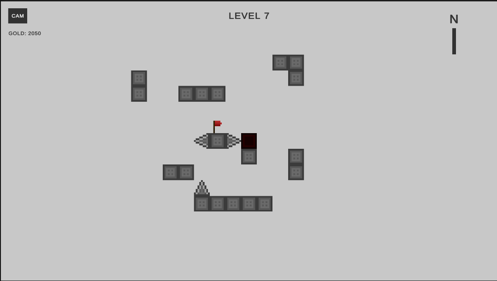
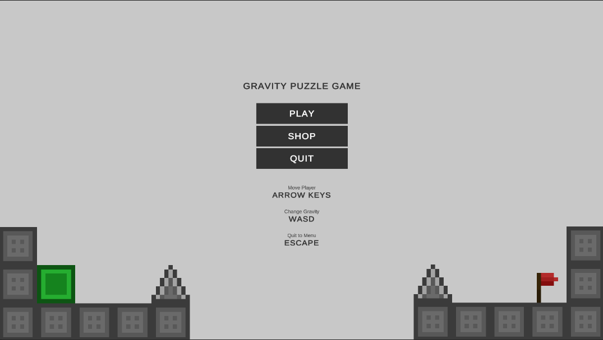
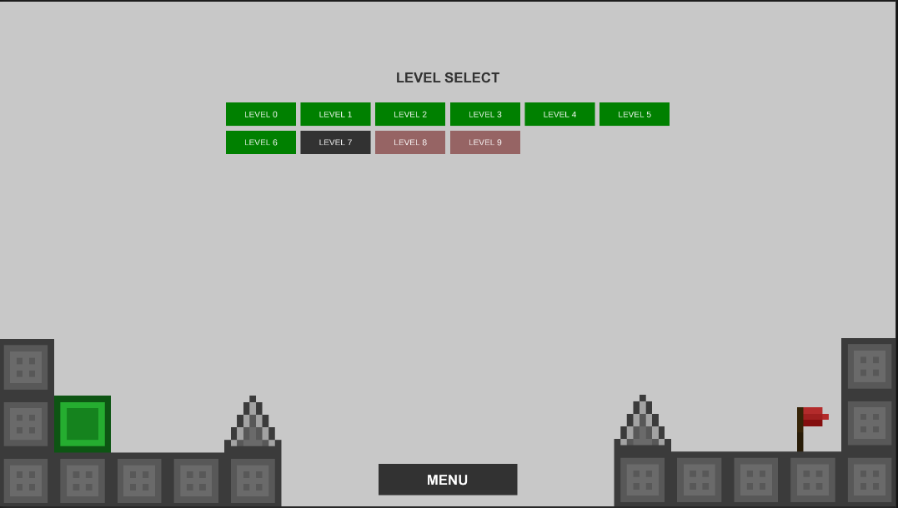
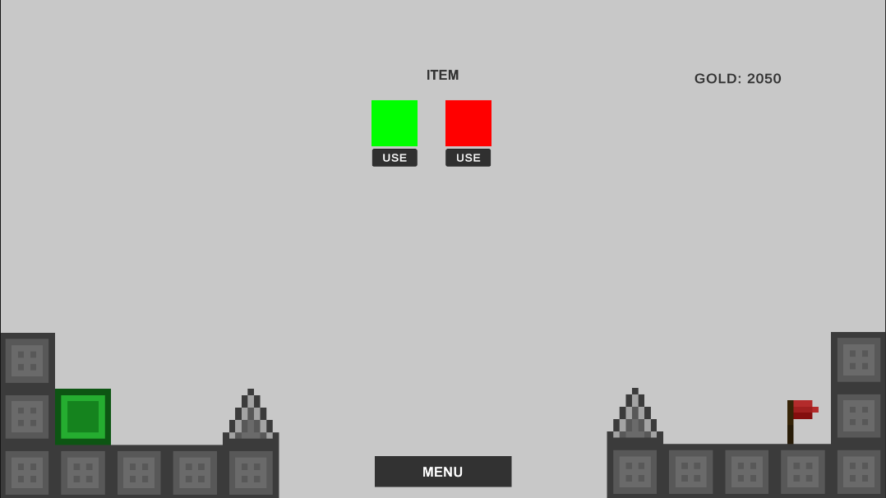

# Gravity puzzle game


A 2D puzzle game where you control gravity to reach the end flag.

## Features

- **Gravity Manipulation**: Change gravity direction using WASD keys
- **Challenging Levels**: Multiple levels with increasing difficulty
- **Shop System**: Buy and customize player skins with earned gold
- **Smooth Controls**: Responsive movement and gravity mechanics
- **Currency System**: Earn gold by completing levels

## Controls

- **Arrow Keys**: Move left/right
- **W/A/S/D**: Change gravity direction
- **ESC**: Return to menu

## Getting Started

### Prerequisites

- Unity 2021.3 LTS or higher

### Installation

1. Clone the repository
   ```bash
   git clone https://github.com/bxviet515/gravity-puzzle-game.git
   ```
2. Open Unity Hub
3. Click "Add" and select the cloned project folder
4. Wait for Unity to import packages and generate files
5. Open Assets/Scenes/Menu.unity scene
6. Press Play to start the game

## Scenes

### Menu



### Select levels



### Shop


